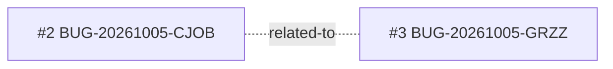

<!-- GENERATED, DO NOT EDIT: regenerado por /reversa-debugger-graph em 2026-10-05T12:30:00Z a partir de 2 bugs -->

# Grafo de Bugs · dashboard-visao-geral

## Mermaid

Uma aresta `proposed` (tracejada): hipótese, não fato.

## Clusters

Nenhum cluster estrutural (2 bugs, relação apenas temática `related-to`).

## Impact score (heurística de triagem, não substitui priority/severity)

Sem bugs abertos: nenhum impact score calculado.
