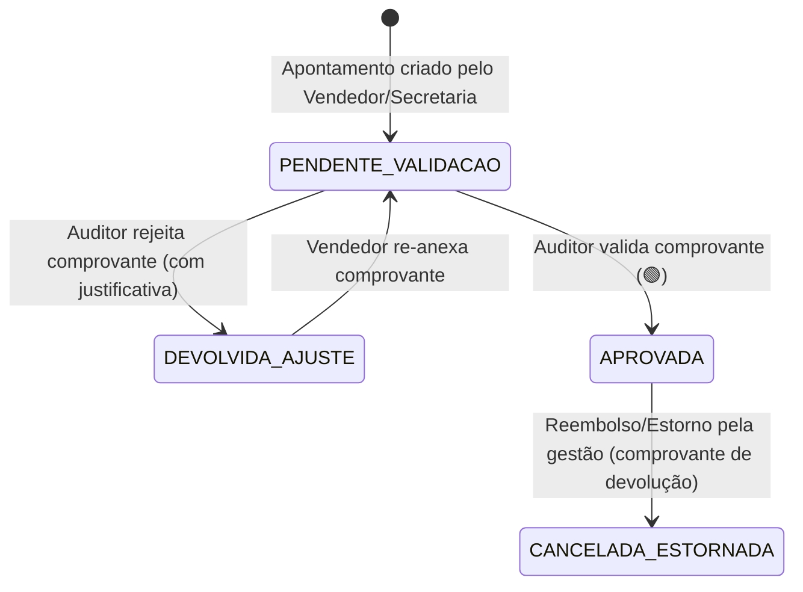

# Documento Canônico de Decisões de Negócio — Gate Pré-Forward

> Selo 🟢 CONFIRMADO (Decisões de Negócio Homologadas pelo Usuário)  
> Data: 2026-07-23  
> Status: Aprovado  

Este documento unifica e padroniza o **Modelo Canônico de Dados, Máquina de Estados, Permissões RBAC e Regras de Negócio** para resolver todas as ambiguidade e divergências identificadas entre as especificações SDD iniciais antes de avançar para a fase de código/forward.

---

## 1. Decisões de Negócio Homologadas

| ID | Tema | Decisão Homologada | Impacto nas Specs |
|---|---|---|---|
| **DEC-01** | **Escopo de Pagamento (V1)** | **Opção A:** O sistema registra apenas a **entrada inicial (matrícula/primeiro pagamento)** da venda com seu comprovante em imagem. Controle de parcelas/recebíveis futuros fica fora da V1. | Elimina complexidade de gestão de parcelas/inadimplência na V1. |
| **DEC-02** | **Regra de Comissão** | **Opção D:** Cada curso tem um **valor de comissão fixo em R$** (definido no cadastro do curso), em vez de percentual dinâmico. | `catalogo-cursos` e `comissoes-livro-caixa` passam a usar `valor_comissao_fixo` (R$). |
| **DEC-03** | **Gatilho de Pagamento de Comissão** | **Opção C:** A comissão é liberada para pagamento **apenas após o início oficial das aulas do curso** (data de início do curso <= data atual), além da aprovação do auditor. | Adiciona a trava `data_inicio_curso` como pré-requisito para mudança de status da comissão para `LIBERADA`. |
| **DEC-04** | **Escopo do Perfil Secretaria** | **Opção A:** A Secretaria enxerga **apenas suas próprias vendas e matrículas** (comissão individual e isolamento igual ao vendedor comercial). | RLS e filtros RBAC padronizados: Vendedor e Secretaria acessam somente a sua própria produção. |
| **DEC-05** | **Regra de Comprovante de Evidência** | **Opção A:** **1 Comprovante = 1 Venda**. Não é permitido reutilizar o mesmo comprovante em múltiplos apontamentos. | Validação estrita por hash SHA-256 do arquivo de imagem para evitar duplicidade. |
| **DEC-06** | **Ciclo de Fechamento Financeiro** | **Opção A:** Ciclo **Mensal** com corte no último dia do mês às 23:59:59. | Filtros e apurações do Livro-Caixa e Dashboard agrupados por mês de competência. |
| **DEC-07** | **Métricas de Contrato e Documentos** | **Separadas em 2 Indicadores:** (1) *Taxa de Emissão de Contrato* (% de vendas com minuta gerada) e (2) *Taxa de Regularização Documental* (% de alunos com checklist 100% entregue). | Alinha a meta do PRD com a funcionalidade de emissão com ressalva documental. |

---

## 2. Modelo Canônico de Dados e Nomenclaturas

Para eliminar conflitos entre tabelas e enums nos diferentes SDDs:

### 2.1. Entidades Principais (Nomes Unificados)

- **`vendas`** (antigo `apontamentos_vendas` / `vendas`): Tabela principal de registros de vendas.
- **`alunos`**: Tabela de dados cadastrais do aluno.
- **`cursos`**: Tabela do catálogo de cursos.
- **`evidencias_vendas`**: Fotos/prints dos comprovantes de pagamento.
- **`documentos_alunos`**: Checklist e arquivos de RG, CPF, Comprovante de Residência, Histórico.
- **`comissoes`**: Lançamentos de comissão por venda.
- **`livro_caixa_lancamentos`**: Registro imutável (*append-only*) de créditos e débitos (estornos/reembolsos).

### 2.2. Máquina de Estados da Venda e Auditoria

**Significado dos Status (`status_venda`):**
1. `PENDENTE_VALIDACAO` (🟡): Venda cadastrada com comprovante, aguardando conferência do auditor.
2. `DEVOLVIDA_AJUSTE` (🔴): Comprovante rejeitado pelo auditor. Comissão bloqueada.
3. `APROVADA` (🟢): Comprovante validado. Comissão habilitada para o próximo passo.
4. `CANCELADA_ESTORNADA` (⚪): Venda estornada por reembolso. Gera contra-lançamento negativo no Livro-Caixa.

### 2.3. Máquina de Estados da Comissão (`status_comissao`)

1. `BLOQUEADA_AUDITORIA` (🟡): Venda ainda não foi aprovada pelo auditor.
2. `AGUARDANDO_INICIO_AULAS` (🔵): Venda aprovada, mas a data de início do curso é futura.
3. `LIBERADA_PAGAMENTO` (🟢): Venda aprovada E aulas iniciadas. Pronta para pagamento no fechamento mensal.
4. `PAGA` (✅): Comissão paga no fechamento mensal (registrado no Livro-Caixa).
5. `ESTORNADA` (🔴): Comissão cancelada devido a estorno/reembolso da venda.

---

## 3. Matriz de Rastreabilidade (Decisões ➔ SDDs Afetados)

| SDD Afetado | Modificações Decorrentes |
|---|---|
| [`autenticacao-controle-acesso.md`](./sdd/autenticacao-controle-acesso.md) | Padroniza RLS: Vendedor e Secretaria possuem exatamente o mesmo isolamento (vêem apenas sua própria produção). |
| [`cadastro-alunos-documentacao.md`](./sdd/cadastro-alunos-documentacao.md) | Mantém emissão de contrato com ressalva, vinculando o indicador de "Regularização Documental". |
| [`catalogo-cursos-regras-comissao.md`](./sdd/catalogo-cursos-regras-comissao.md) | Atualiza regra de comissão para `valor_comissao_fixo` (R$) por curso. |
| [`apontamento-vendas-cotacoes.md`](./sdd/apontamento-vendas-cotacoes.md) | Unifica tabela `vendas`, aplica trava anti-duplicidade no hash SHA-256 do comprovante (1 comprovante = 1 venda). |
| [`auditoria-apontamentos.md`](./sdd/auditoria-apontamentos.md) | Padroniza status `DEVOLVIDA_AJUSTE` e adiciona validação da data de início do curso. |
| [`comissoes-livro-caixa.md`](./sdd/comissoes-livro-caixa.md) | Aplica trava de liberação `LIBERADA_PAGAMENTO` apenas quando `status_venda == APROVADA` E `data_inicio_curso <= data_atual`. |
| [`geracao-contrato-plano-financeiro.md`](./sdd/geracao-contrato-plano-financeiro.md) | Foco na minuta e dados cadastrais da entrada na V1 (sem parcelamento futuro/boletos bancários na V1). |
| [`dashboard-gerencial-relatorios.md`](./sdd/dashboard-gerencial-relatorios.md) | Métricas atualizadas para o ciclo de fechamento mensal e valor fixo por venda. |

---

Gerado em 2026-07-23 como Fonte Canônica do Gate Pré-Forward.

---

## 4. Decisões de Arquitetura (ADRs)

> Seção adicionada em 2026-07-27 pelo Reversa (Fase de Interpretação), após debate agentico com o usuário.
> Estes ADRs tratam da **stack de implementação**, complementando as DEC-01..07 (que tratam de regras de negócio). Não alteram decisões homologadas acima.

### ADR-001 — Stack de implementação: TypeScript (Next.js + Supabase Edge Functions)

**Status:** ✅ Aceito · **Data:** 2026-07-27 · **Decisor:** adelino (homologado)

**Contexto**

Durante a engenharia reversa (Fase 2, `code-analysis.md` + `questions.md`) constatou-se que o projeto é um **experimento**, não um sistema em produção:
- Nenhuma das três camadas (DDL, backend Rust, frontend Next.js) jamais correu junto. O backend Rust **não compila** contra o DDL canônico (`001_schema.sql`) — usa colunas/tabelas inexistentes (`status` vs `status_venda`, `evidencias_venda` vs `evidencias_vendas`, `valor_total`, `percentual_comissao`, `usuarios`).
- O backend Rust foi uma **decisão de stack aleatória** (recomendação informal de "linguagem mais leve/rápida"), adotada para fins de aprendizado e diversificação de portfólio.
- O frontend Next.js + seus tipos TS (`types/index.ts`) **já estão alinhados ao DDL** — usam `valor_entrada`, `valor_comissao_fixo`, `status_venda`.
- O `decisions-gate.md` (DEC-02) homologou comissão como **valor fixo em R$**, o que o Rust viola com modelo percentual.

**Conclusão da fonte da verdade (resolve L1 do `questions.md`):** o DDL `001_schema.sql` + o `decisions-gate.md` constituem a fonte canônica. O backend Rust é uma reimplementação experimental que divergiu e nunca foi casada. O experimento Rust cumpriu seu objetivo de aprendizado e **não será a base do sistema** (permanece no repositório como registro do experimento, sem ser descartado).

**Decisão**

Adotar **TypeScript fim-a-fim** como stack do sistema:
- **Frontend:** Next.js 14 (App Router) — já existente, mantém PWA, Supabase SSR, Tailwind.
- **Mutações sensíveis** (criar venda, aprovar/devolver auditoria, fechamento mensal, gerar contrato): **Supabase Edge Functions (TypeScript)**, substituindo o backend Rust/Axum. JWT/RLS via SDK `@supabase/ssr` + `supabase-js` (1º partido), eliminando a reimplementação manual de JWKS feita em Rust.
- **Leituras:** Supabase client + RLS (já é a intenção do frontend).
- **Banco/Auth/Storage:** Supabase/Postgres mantidos; DDL `001_schema.sql` é a verdade, sem alteração.

**Justificativa pelos critérios do usuário** (usabilidade, manutenção, custo técnico, custo financeiro, documentação):

| Critério | Rust/Axum (descartado) | TypeScript (adotado) |
|---|---|---|
| Usabilidade / iteração | 🔴 compile lento, SQLx exige DB no build | 🟢 hot reload, SDK Supabase |
| Manutenção (solo) | 🔴 2 linguagens, mais código | 🟢 1 linguagem fim-a-fim, tipos compartilhados |
| Custo técnico (tempo) | 🔴 alto | 🟢 baixo |
| Custo financeiro | 🟢 $0 | 🟢 $0 |
| Documentação p/ este domínio | 🔴 sem SDK 1º-partido, JWKS manual | 🟢 vasta documentação Next.js+Supabase+RLS |

A justificativa original ("Rust é mais leve/rápido") **não se aplica** ao domínio (5 endpoints `POST` com INSERT/UPDATE num Supabase): o gargalo é rede/Postgres, nunca o runtime. Performance não é critério decisivo aqui; usabilidade e velocidade de iteração do protótipo sim.

**Consequências**
- ✅ Elimina a reimplementação manual de JWKS/RLS em Rust ( middleware `auth.rs`/`rls.rs`).
- ✅ Resolve L1, L6 (sentry), L7 (multipart) por substituição, não por saneamento de código que nunca rodou.
- ⚠️ O código Rust existente permanece no repositório como **registro do experimento**, mas **não será mantido/evoluído**. Qualquer evolução do sistema ocorre em TS.
- ⚠️ Decisões ainda em aberto (a serem resolvidas no `/reversa-forward`, não aqui):
  - **L4:** as funções `list`/`calcular`/`process_daily_commission_release` (liberação diária por data de início) serão reimplementadas como Edge Functions / scheduled job (Supabase) ou cron externo?
  - **L5:** porta/roteamento de produção (Edge Functions têm URL própria; o `NEXT_PUBLIC_API_URL` no `.env` precisa de redefinição).
  - **Fixo vs percentual:** resolvido — DEC-02 homologou **fixo**. A Edge Function de comissão usará `valor_comissao_fixo` do curso, gravando `valor_comissao` em `comissoes` no INSERT da venda.

### ADR-002 — Supabase Edge Functions para mutações sensíveis

**Status:** ✅ Aceito · **Data:** 2026-07-27

**Contexto:** as 5 mutações server-side (criar venda, aprovar/devolver, fechamento mensal, gerar contrato) exigem lógica transacional, validação de regras (SHA-256 anti-fraude, gatilho de liberação por data de início, append-only do livro caixa) e uso da **service role key** — não podem rodar só com RLS/anon. Precisam de um backend server-side.

**Decisão:** implementar essas mutações como **Supabase Edge Functions (Deno/TypeScript)**, e não como Next.js API Routes, porque:
- Executam na borda do Supabase, próximas ao banco/Storage (latência).
- Têm acesso à `SERVICE_ROLE_KEY` de forma segura (secrets do Supabase), coisa que API Routes no frontend exporiam.
- Reaproveitam o mesmo runtime TS do frontend (Deno ≈ TS), mantendo 1 linguagem.
- O SDK Supabase serve a validação de JWT e a RLS server-side.

**Trade-off aceito:** Edge Functions têm cold start e limite de duração; aceitável para mutações curtas. A liberação diária de comissões (`process_daily_commission_release`) deve ser um **scheduled function** (cron do Supabase) e não on-demand.

**Consequência:** o `.env.local.example` (`NEXT_PUBLIC_API_URL`) será redefinido para apontar às URLs das Edge Functions no `/reversa-forward`.

---

> **Nota de proveniência:** Esta seção 4 foi produzida pelo Reversa em modo autônomo e reflete o debate agentico registrado no histórico da sessão. As DEC-01..07 acima permanecem inalteradas e canônicas.

