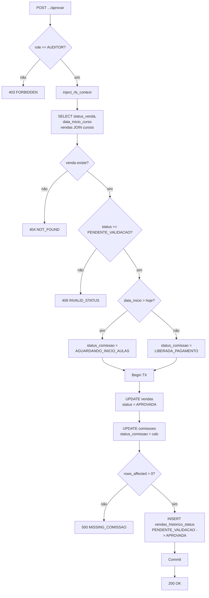
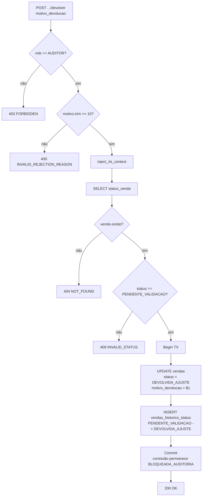

# Flowchart — Módulo `auditoria`

> `POST /api/v1/auditoria/:id/aprovar` e `.../devolver` · `backend/src/routes/auditoria.rs`

## approve

```mermaid
flowchart TD
    A[POST .../aprovar] --> B{role == AUDITOR?}
    B -- não --> X1[403 FORBIDDEN]
    B -- sim --> C[inject_rls_context]
    C --> D[SELECT status_venda,<br/>data_inicio_curso<br/>vendas JOIN cursos]
    D --> E{venda existe?}
    E -- não --> X2[404 NOT_FOUND]
    E -- sim --> F{status == PENDENTE_VALIDACAO?}
    F -- não --> X3[409 INVALID_STATUS]
    F -- sim --> G{data_inicio > hoje?}
    G -- sim --> H[status_comissao =<br/>AGUARDANDO_INICIO_AULAS]
    G -- não --> I[status_comissao =<br/>LIBERADA_PAGAMENTO]
    H --> J[Begin TX]
    I --> J
    J --> K[UPDATE vendas<br/>status = APROVADA]
    K --> L[UPDATE comissoes<br/>status_comissao = calc]
    L --> M{rows_affected > 0?}
    M -- não --> X4[500 MISSING_COMISSAO]
    M -- sim --> N[INSERT vendas_historico_status<br/>PENDENTE_VALIDACAO -> APROVADA]
    N --> O[Commit]
    O --> P[200 OK]
```

## devolver

```mermaid
flowchart TD
    A[POST .../devolver<br/>motivo_devolucao] --> B{role == AUDITOR?}
    B -- não --> X1[403 FORBIDDEN]
    B -- sim --> C{motivo.trim >= 10?}
    C -- não --> X2[400 INVALID_REJECTION_REASON]
    C -- sim --> D[inject_rls_context]
    D --> E[SELECT status_venda]
    E --> F{venda existe?}
    F -- não --> X3[404 NOT_FOUND]
    F -- sim --> G{status == PENDENTE_VALIDACAO?}
    G -- não --> X4[409 INVALID_STATUS]
    G -- sim --> H[Begin TX]
    H --> I[UPDATE vendas<br/>status = DEVOLVIDA_AJUSTE<br/>motivo_devolucao = $1]
    I --> J[INSERT vendas_historico_status<br/>PENDENTE_VALIDACAO -> DEVOLVIDA_AJUSTE]
    J --> K[Commit<br/>comissão permanece BLOQUEADA_AUDITORIA]
    K --> P[200 OK]
```
