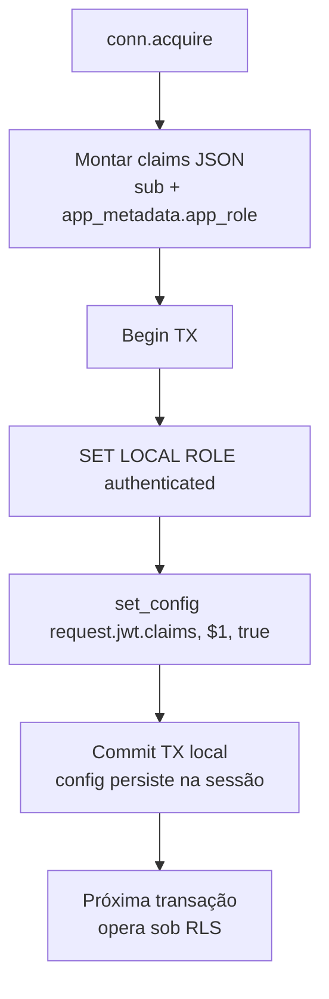

# Flowchart — Módulo `auth-rls`

> `middleware/auth.rs` (validação JWT) + `middleware/rls.rs` (injeção RLS)

## Validação do JWT (extractor `AuthUser`)

```mermaid
flowchart TD
    A[Request entra] --> B{Header Authorization<br/>Bearer presente?}
    B -- não --> X1[401 MissingToken]
    B -- scheme errado --> X2[401 InvalidScheme]
    B -- sim --> C[decode_header -> kid]
    C --> D[GET JWKS<br/>{SUPABASE_URL}/auth/v1/.well-known/jwks.json]
    D --> E{fetch ok?}
    E -- não --> X3[401 JwksFetch]
    E -- sim --> F[Encontrar JWK por kid]
    F --> G[DecodingKey from n,e]
    G --> H[decode JwtClaims<br/>RS256, aud=authenticated,<br/>iss={SUPABASE_URL}/auth/v1]
    H --> I{token válido?}
    I -- não --> X4[401 InvalidToken]
    I -- sim --> J[sub -> UUID, app_role]
    J --> K[AuthUser in extractor]
```

🟡 JWKS buscado a cada request (sem cache) — risco de latência/falha.

## Injeção de contexto RLS (antes de cada mutação)


