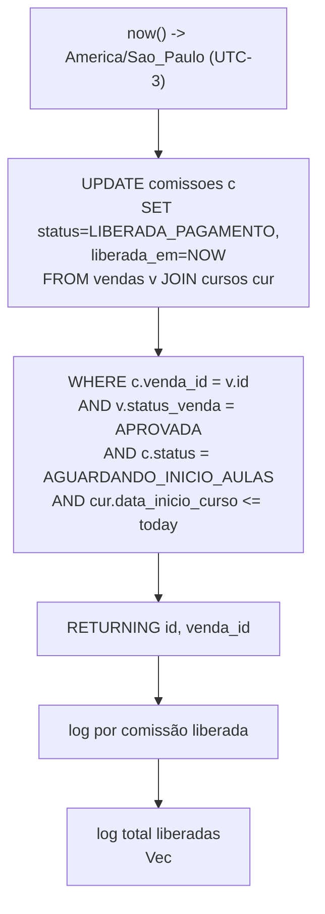
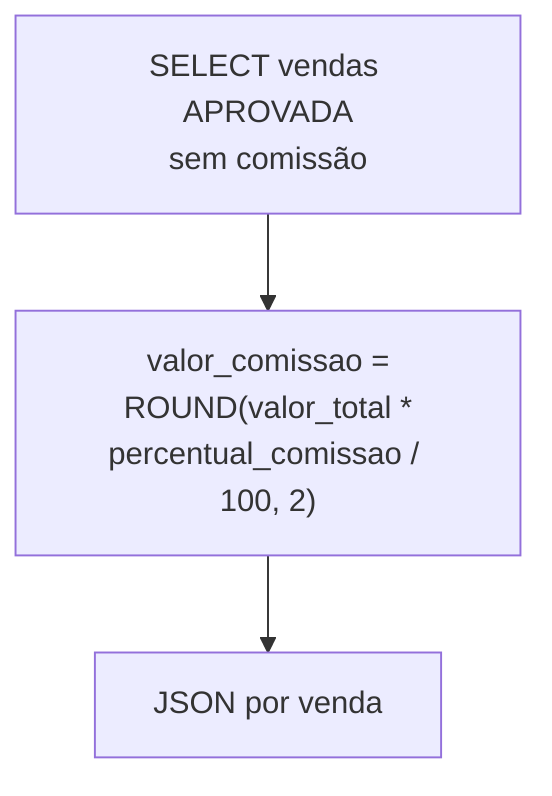

# Flowchart — Módulo `comissoes`

> `backend/src/routes/comissoes.rs`
> 🔴 Funções `list`/`calcular` não estão wired em `main.rs` (L4). `process_daily_commission_release` é job.

## `process_daily_commission_release` (job diário)

## `calcular` (não exposta)

🔴 Usa colunas inexistentes (`v.valor_total`, `cr.percentual_comissao`, `v.vendedor_id`, `usuarios`). DDL usa `valor_comissao_fixo`. Decisão de negócio não resolvida (I2: fixo vs percentual).
