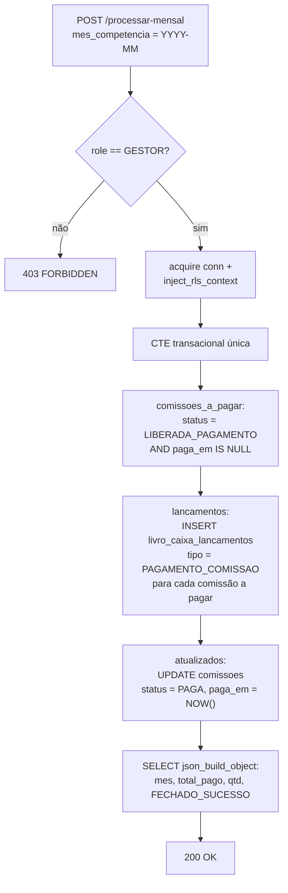

# Flowchart — Módulo `fechamento`

> `POST /api/v1/fechamento/processar-mensal` · `backend/src/routes/fechamento.rs::processar`
> 🔴 divergências de colunas em questions.md (L1)

🔴 Colunas usadas no INSERT (`tipo`, `venda_id`, `valor`, `descricao`, `created_at`) não existem no DDL (reais: `tipo_lancamento`, `comissao_id`, `valor_credito`/`valor_debito`, `historico`, `criado_em`).
