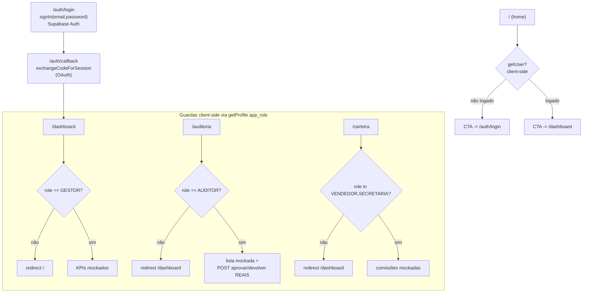

# Flowchart — Módulos Frontend

> Next.js App Router. 🔴 Páginas majoritariamente mockadas (L8).

## Fluxo de autenticação e guardas de rota

🟡 Guardas são **client-side** (`getProfile` + `router.push`), sem middleware Next.js server-side — risco de flash/contorno.

## Fluxo de apontamento (`/vendas/novo`)

```mermaid
flowchart TD
    A[Step 1: buscar aluno<br/>MOCK_ALUNOS] --> B{selecionado?}
    B -- não --> A
    B -- sim --> C[Step 2: escolher curso<br/>MOCK_CURSOS]
    C --> D{selecionado?}
    D -- não --> C
    D -- sim --> E[Step 3: valor entrada +<br/>dropzone comprovante +<br/>checklist documentos]
    E --> F[handleSubmit]
    F --> G["fetch /api/v1/vendas<br/>JSON body"]:::mock
    G --> H{status 409?}
    H -- sim --> I[erro: duplicada]
    H -- não ok --> J[sucesso #id]
    classDef mock fill:#3a1d1d,stroke:#e55,stroke-dasharray:5 5;
```

🔴 **L7:** envia `Content-Type: application/json`, mas o backend exige `Multipart` com `comprovante_file`. O upload real do arquivo **não ocorre** — frontend ainda protótipo.
