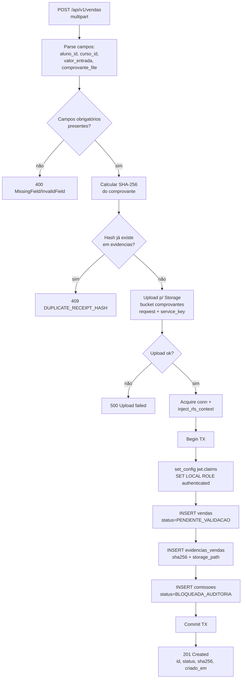

# Flowchart — Módulo `vendas`

> `POST /api/v1/vendas` · `backend/src/routes/vendas.rs::create`
> 🟢 CONFIRMADO do código · 🔴 divergências DDL em questions.md (L1)

🔴 O INSERT em `vendas` omite `criado_por` (NOT NULL); o INSERT em `comissoes` omite `beneficiario_id` e `valor_comissao` (NOT NULL). Nomes de coluna divergem do DDL.
