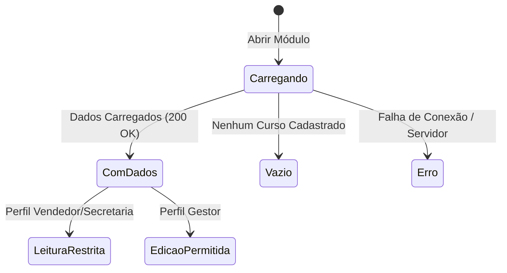
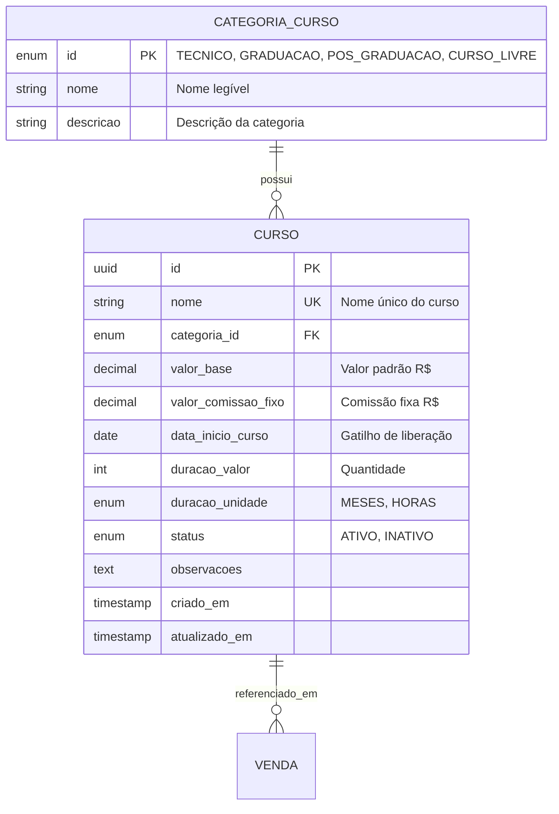

# Especificação Técnica SDD — Catálogo de Cursos e Regras de Comissão (`catalogo-cursos-regras-comissao`)

> Selo 🟡 PLANEJADO em todos os itens. Documento elaborado com base no PRD, Ideation e Personas do Sistema de Comissionamento e Vendas.

**Versão:** 1.0.0  
**Data:** 2026-07-23  
**Autor:** reversa-spec-writer  
**Status:** 🟡 Planejado  
**Componente:** `catalogo-cursos-regras-comissao`  

---

## 1. Resumo

🟢 O módulo **Catálogo de Cursos e Regras de Comissão** (`catalogo-cursos-regras-comissao`) é a fonte central de verdade para a gestão de produtos educacionais ofertados pela instituição de ensino e para o valor fixo de comissão de cada curso.

Este componente gerencia os cadastros de cursos organizados em 4 categorias nativas (**Técnico**, **Graduação**, **Pós-Graduação** e **Cursos Livres**) e registra `valor_comissao_fixo` em reais diretamente em cada curso. O módulo fornece interfaces de consulta e APIs para o motor de comissão no momento do apontamento da venda.

---

## 2. Contexto e Motivação

🟡 Na operação atual da escola, a falta de padronização na oferta de cursos e nos valores de comissão gera incerteza tanto para a equipe comercial quanto para a gestão financeira. Valores de comissão negociados de forma informal geram divergências no fechamento mensal e em estornos.

A centralização do catálogo e dos valores fixos por curso resolve esses gargalos:
1. **Padronização da Oferta:** Todos os vendedores e secretários trabalham com a mesma lista de cursos ativos, valores atualizados e durações oficiais.
2. **Cálculo Transparente e Automatizado:** O valor fixo do curso alimenta diretamente o motor de comissionamento, eliminando cálculos manuais e ambiguidades.
3. **Auditabilidade Histórica:** A venda registra um snapshot imutável do valor de comissão do curso; alterações futuras não a afetam.

---

## 3. Objetivos (Goals) e Não-Objetivos (Non-Goals)

### 3.1 Objetivos (Goals) 🟡
- 🟡 Garantir a gestão completa (CRUD) dos cursos vinculados às 4 categorias padrão: Técnico, Graduação, Pós-Graduação e Cursos Livres.
- 🟢 Permitir que o perfil **Gestor** configure `valor_comissao_fixo` em R$ diretamente no curso (ex.: R$ 50,00 para Técnico e R$ 100,00 para Pós-Graduação).
- 🟡 Disponibilizar consulta rápida ao catálogo e regras vigentes para os perfis **Vendedor Comercial** e **Secretaria** (modo somente leitura).
- 🟢 Manter histórico auditável e imutável das alterações do valor fixo por curso, com data/hora e responsável.
- 🟡 Respeitar rigorosamente a premissa de negócio: **1 Venda = 1 Curso + 1 Aluno**.

### 3.2 Não-Objetivos (Non-Goals) 🟡
- 🟡 **NÃO** gerenciar turmas, diários de classe, professores, vagas ou salas de aula.
- 🟡 **NÃO** processar pagamentos de mensalidades, cobranças recorrentes ou integração com gateways de cartão/Pix nesta versão.
- 🟢 **NÃO** permitir percentuais, regras por categoria ou valores personalizados por vendedor; a comissão é um valor fixo do curso.
- 🟡 **NÃO** gerenciar catálogo de materiais didáticos, uniformes ou taxas administrativas avulsas.

---

## 4. Personas e Usuários Afetados

🟡 O componente atende diretamente às três personas principais mapeadas no projeto:

| Persona | Papel no Módulo | Necessidade Principal |
|---|---|---|
| **Roberto Gestor** (Gestor / Auditor) | Administrador do Catálogo e Regras | Cadastrar/inativar cursos, definir comissão fixa por curso e auditar seu histórico. |
| **Marcos Vendedor** (Vendedor Comercial) | Consumidor do Catálogo (Mobile/Desktop) | Consultar rapidamente cursos ativos, preços, durações e valor fixo de comissão para efetuar apontamentos. |
| **Ana Secretaria** (Secretaria) | Consumidora do Catálogo (Desktop) | Consultar valores e dados oficiais dos cursos para emissão de minutas de contrato e lançamento de matrículas no balcão. |

---

## 5. Requisitos Funcionais (RF)

All requirements use the `RF-XX` standard format, are atomic, testable, and include Happy Path and Alternative Flows. All items are sealed with 🟡.

### RF-01: Manutenção de Categorias de Curso Nativas 🟡
- **Descrição:** O sistema deve manter 4 categorias fixas nativas: `TECNICO` (Técnico), `GRADUACAO` (Graduação), `POS_GRADUACAO` (Pós-Graduação) e `CURSO_LIVRE` (Cursos Livres).
- **Critério de Aceite:** As 4 categorias estão sempre disponíveis no sistema e não podem ser excluídas ou renomeadas por usuários.
- **Fluxo Principal (Caminho Feliz):**
  1. O usuário acessa o cadastro ou filtro de cursos.
  2. O sistema exibe exatamente as 4 categorias nativas disponíveis para seleção.
- **Fluxo Alternativo (FA-01.1 — Tentativa de exclusão/adição via API):**
  1. Requisição externa tenta criar uma nova categoria ou deletar uma categoria nativa.
  2. O sistema rejeita com erro HTTP 400 (`CAT_RESTRITA_SISTEMA`).

### RF-02: Comissão Fixa por Curso 🟢
- **Descrição:** O perfil Gestor deve conseguir definir e atualizar `valor_comissao_fixo` em R$ em cada curso.
- **Critério de Aceite:** Ao atualizar o valor de um curso, novas vendas usam o novo valor; vendas existentes preservam o snapshot gravado no seu registro de comissão.
- **Fluxo Principal (Caminho Feliz):**
  1. O Gestor edita um curso.
  2. Informa, por exemplo, R$ 50,00 como comissão fixa.
  3. Clica em "Salvar Curso".
  4. O sistema persiste o valor e um evento de auditoria com o valor anterior e o novo.
- **Fluxo Alternativo (FA-02.1 — Valor Inválido):**
  1. O Gestor informa valor negativo.
  2. O sistema bloqueia e informa `VAL_INVALIDO_COMISSAO: informe um valor igual ou superior a R$ 0,00`.
- **Fluxo Alternativo (FA-02.2 — Acesso Negado):**
  1. Um Vendedor ou Secretária tenta acionar o endpoint de alteração de regra.
  2. O sistema bloqueia com erro HTTP 403 (`PERMISSAO_NEGADA_GESTOR`).

### RF-03: Cadastro e Edição de Cursos 🟡
- **Descrição:** O perfil Gestor deve cadastrar novos cursos especificando: Nome, Categoria, Valor Base (R$), `valor_comissao_fixo` (R$), Data de Início do Curso, Duração, Status e Observações.
- **Critério de Aceite:** Curso é salvo com sucesso e disponibilizado imediatamente para apontamento caso o status seja `Ativo`.
- **Fluxo Principal (Caminho Feliz):**
  1. O Gestor clica em "Novo Curso".
  2. Preenche Nome ("Técnico em Enfermagem"), Categoria ("Técnico"), Valor Base (R$ 450,00), Comissão fixa (R$ 50,00), Data de início e Duração (24 Meses).
  3. Clica em "Salvar Curso".
  4. O sistema valida os campos, persiste no banco e atualiza a lista de cursos ativos.
- **Fluxo Alternativo (FA-03.1 — Nome de Curso Duplicado):**
  1. O Gestor digita um nome de curso já existente no banco (case-insensitive).
  2. O sistema exibe o aviso `CURSO_DUPLICADO: Já existe um curso cadastrado com este nome.` e impede o salvamento.
- **Fluxo Alternativo (FA-03.2 — Valor Base Negativo ou Zero):**
  1. O Gestor informa R$ 0,00 ou valor negativo para o curso.
  2. O sistema bloqueia e informa `VAL_INVALIDO_CURSO: O valor base do curso deve ser maior que R$ 0,00`.

### RF-04: Ativação e Inativação de Cursos 🟡
- **Descrição:** O Gestor pode alterar o status de um curso entre `Ativo` e `Inativo`. Cursos inativos ficam ocultos na seleção de novos apontamentos de vendas.
- **Critério de Aceite:** Cursos inativados não aparecem para seleção em novos apontamentos, mas permanecem associados às vendas históricas.
- **Fluxo Principal (Caminho Feliz):**
  1. O Gestor seleciona um curso na lista e clica em "Inativar".
  2. O sistema confirma a alteração de status para `INATIVO`.
  3. O curso deixa de aparecer na lista de cursos disponíveis para Vendedores e Secretaria.
- **Fluxo Alternativo (FA-04.1 — Reativação de Curso):**
  1. O Gestor filtra a lista por "Inativos", seleciona o curso e clica em "Reativar".
  2. O status altera para `ATIVO` e o curso volta a aparecer para seleção em novos apontamentos.

### RF-05: Consulta ao Catálogo por Vendedores e Secretaria 🟡
- **Descrição:** Vendedores e Secretaria devem consultar cursos ativos por categoria ou busca, visualizando nome, categoria, valor, duração, data de início e comissão fixa.
- **Critério de Aceite:** A busca retorna resultados em menos de 200ms e omite cursos inativos.
- **Fluxo Principal (Caminho Feliz):**
  1. O Vendedor acessa a aba "Catálogo de Cursos" no celular.
  2. Seleciona o filtro "Graduação".
  3. O sistema exibe os cards dos cursos de Graduação ativos, incluindo o selo `Comissão: R$ 100,00`.
- **Fluxo Alternativo (FA-05.1 — NENHUM Resultado Encontrado):**
  1. O usuário digita um termo de busca inexistente (ex.: "Robótica Avançada").
  2. O sistema exibe o estado de busca vazia: `Nenhum curso encontrado com os termos pesquisados.` com botão para limpar filtros.

### RF-06: Histórico de Alterações da Comissão do Curso (Audit Trail) 🟢
- **Descrição:** O sistema deve registrar e permitir a visualização do histórico completo de alterações de `valor_comissao_fixo` por curso.
- **Critério de Aceite:** O histórico mostra data/hora, valor anterior, valor novo e Gestor responsável.
- **Fluxo Principal (Caminho Feliz):**
  1. O Gestor clica em "Histórico de Comissão" em um curso.
  2. O sistema exibe uma linha do tempo com todas as versões passadas da regra.
- **Fluxo Alternativo (FA-06.1 — Categoria Sem Alterações Anteriores):**
  1. O Gestor consulta o histórico de um curso que mantém o valor inicial.
  2. O sistema exibe a mensagem `Comissão original definida na criação do curso.`.

### RF-07: Provimento de Dados para Cálculo de Comissão de Venda 🟡
- **Descrição:** O módulo deve expor função interna para fornecer o snapshot do curso, `valor_comissao_fixo` e `data_inicio_curso` no momento do apontamento.
- **Critério de Aceite:** O retorno contém ID do curso, categoria, valor base, valor fixo e data de início necessários ao motor de comissão.
- **Fluxo Principal (Caminho Feliz):**
  1. Módulo de Vendas solicita os dados do curso `UUID_CURSO` para o timestamp `2026-07-23 14:00:00`.
  2. O módulo retorna o snapshot do curso, inclusive valor fixo e data de início, para o cálculo.

---

## 6. Requisitos Não-Funcionais (RNF)

| Código | Categoria | Descrição | Selo |
|---|---|---|---|
| **RNF-01** | Performance | A consulta e listagem de cursos ativos deve responder em menos de **200ms** no 95º percentil (p95) para até 1.000 cursos cadastrados. | 🟡 |
| **RNF-02** | Cacheability | O catálogo de cursos ativos possui cache invalidado automaticamente em qualquer mutação de curso ou valor de comissão. | 🟡 |
| **RNF-03** | Auditabilidade | Alterações de `valor_comissao_fixo` geram evento de auditoria append-only. | 🟡 |
| **RNF-04** | Usabilidade Mobile | A interface de consulta para Vendedores deve ser 100% responsiva, adaptada para telas sensíveis ao toque (touch-friendly), com botões de no mínimo 44x44px. | 🟡 |
| **RNF-05** | Integridade Referencial | NENHUM curso pode ser excluído fisicamente (`SQL DELETE`) do banco de dados caso possua vínculo com vendas; a desativação deve ocorrer obrigatoriamente via *Soft Delete* (`status = INATIVO`). | 🟡 |

---

## 7. Design e Interface de Usuário (UI States)

🟡 A interface adapta-se ao perfil do usuário conectado e gerencia os 5 estados clássicos de UI:

### 7.1 Visão da Interface por Perfil 🟡
- **Visão do Gestor (Desktop/Mobile):**
  - **Tabela de Cursos:** exibe comissão fixa por curso (ex.: `R$ 50,00`) e ação "Editar Curso".
  - **Tabela de Cursos:** Filtros de busca, botão "+ Criar Novo Curso", colunas: Nome, Categoria, Valor (R$), Duração, Status (`ATIVO`/`INATIVO`), Ações (`Editar`, `Inativar/Reativar`).
- **Visão do Vendedor / Secretaria (Mobile/Desktop):**
  - **Barra de Pílulas de Categoria:** `[ Todos ]` `[ Técnico ]` `[ Graduação ]` `[ Pós-Graduação ]` `[ Cursos Livres ]`.
  - **Campo de Busca Instantânea:** Digitação com filtro dinâmico.
  - **Cards de Cursos (Grid Mobile):** Card com Nome do Curso, Categoria, Valor em destaque, Duração e badge visual indicando a comissão estimada da categoria (ex.: `Comissão: 5%`).

### 7.2 Estados da Interface (UI States) 🟡



1. 🟡 **Empty State (Estado Vazio):**
   - *Cenário:* Categoria selecionada não possui cursos cadastrados ou busca não encontrou resultados.
   - *Interface:* Ilustração suave de busca vazia com a mensagem: *"Nenhum curso encontrado nesta categoria."* Botão *"Limpar Filtros"* ou *"+ Cadastrar Curso"* (se Gestor).
2. 🟡 **Loading State (Estado de Carregamento):**
   - *Cenário:* Requisição inicial ou troca de categoria em andamento.
   - *Interface:* *Skeleton Screen* imitando 4 cards de categoria no topo e 5 linhas de tabela/cards cinzas pulsantes.
3. 🟡 **Error State (Estado de Erro):**
   - *Cenário:* Falha na comunicação com o servidor ou token expirado.
   - *Interface:* Banner de alerta topo de tela: *"Não foi possível carregar o catálogo de cursos. Verifique sua conexão."* com botão *"Tentar Novamente"*.
4. 🟡 **Success / Active State (Estado Ativo com Dados):**
   - *Cenário:* Dados carregados com sucesso.
   - *Interface:* Exibição fluida das pílulas, cards e tabela. Ao salvar curso ou comissão fixa, exibe *Toast Notification* verde.
5. 🟡 **Read-Only / Permission State (Estado de Permissão Somente Leitura):**
   - *Cenário:* Usuário com perfil Vendedor ou Secretaria acessando a tela.
   - *Interface:* Botões de edição são ocultados. O valor de comissão é somente informativo.

---

## 8. Modelo de Dados (Data Model)

🟡 O esquema relacional é estruturado para garantir integridade, velocidade de leitura e rastreabilidade temporal.



### 8.1 Dicionário de Dados 🟡

#### Tabela: `categoria_curso` (Tabela Estática / Enum)
- `id` (ENUM, PK): Identificador fixo (`TECNICO`, `GRADUACAO`, `POS_GRADUACAO`, `CURSO_LIVRE`).
- `nome` (VARCHAR(50), NOT NULL): Nome formatado para exibição ("Técnico", "Graduação", "Pós-Graduação", "Cursos Livres").
- `descricao` (TEXT, NULLABLE): Descrição detalhada da modalidade.

#### Tabela: `curso` (Cadastro de Cursos)
- `id` (UUID, PK): Identificador único do curso.
- `nome` (VARCHAR(150), NOT NULL, UNIQUE): Nome oficial do curso.
- `categoria_id` (ENUM, FK `categoria_curso.id`, NOT NULL): Categoria à qual o curso pertence.
- `valor_base` (DECIMAL(10,2), NOT NULL): Valor base de tabela do curso em R$.
- `valor_comissao_fixo` (DECIMAL(10,2), NOT NULL): Comissão fixa em reais para cada venda do curso.
- `data_inicio_curso` (DATE, NOT NULL): Data oficial de início das aulas; condição para liberar a comissão após auditoria.
- `duracao_valor` (INTEGER, NOT NULL): Quantidade numérica da duração (ex.: 18, 400).
- `duracao_unidade` (ENUM, NOT NULL): Unidade de medida (`MESES`, `HORAS`).
- `status` (ENUM, NOT NULL, DEFAULT 'ATIVO'): Estado operacional do curso (`ATIVO`, `INATIVO`).
- `observacoes` (TEXT, NULLABLE): Notas internas sobre o curso.
- `criado_em` (TIMESTAMPTZ, NOT NULL): Data/hora de inclusão.
- `atualizado_em` (TIMESTAMPTZ, NOT NULL): Data/hora da última edição.

### 8.2 Regras de Validação de Dados 🟡
- `valor_comissao_fixo`: `valor_comissao_fixo >= 0.00`.
- `valor_base`: `valor_base > 0.00`.
- `duracao_valor`: `duracao_valor > 0`.
- `nome`: Não vazio, sem espaços nas extremidades (trimmed), único no banco de dados.

---

## 9. Integrações e Arquitetura de Contratos

🟡 Definição dos contratos de API REST expostos pelo componente:

### 9.1 Endpoints do Catálogo de Cursos 🟡

#### `GET /api/v1/catalogo/cursos`
- **Descrição:** Lista cursos cadastrados com filtros opcionais.
- **Acesso:** Autenticado (`GESTOR`, `VENDEDOR`, `SECRETARIA`).
- **Query Parameters:**
  - `categoria` (opcional): `TECNICO` | `GRADUACAO` | `POS_GRADUACAO` | `CURSO_LIVRE`
  - `status` (opcional): `ATIVO` (padrão para Vendedor/Secretaria) | `INATIVO` | `TODOS`
  - `busca` (opcional): Texto para busca por nome do curso.
- **Resposta Sucesso (200 OK):**
```json
{
  "sucesso": true,
  "dados": [
    {
      "id": "c1a2b3c4-90ab-4cde-8f01-1234567890ab",
      "nome": "Técnico em Enfermagem",
      "categoria": {
        "id": "TECNICO",
        "nome": "Técnico"
      },
      "valor_base": 450.00,
      "valor_comissao_fixo": 50.00,
      "data_inicio_curso": "2026-08-01",
      "duracao": {
        "valor": 24,
        "unidade": "MESES"
      },
      "status": "ATIVO",
      "observacoes": "Inclui material digital"
    }
  ]
}
```

#### `POST /api/v1/catalogo/cursos`
- **Descrição:** Cadastra um novo curso.
- **Acesso:** Restrito ao perfil `GESTOR`.
- **Payload de Entrada:**
```json
{
  "nome": "Pós-Graduação em Gestão Escolar",
  "categoria_id": "POS_GRADUACAO",
  "valor_base": 380.00,
  "valor_comissao_fixo": 100.00,
  "data_inicio_curso": "2026-08-15",
  "duracao_valor": 12,
  "duracao_unidade": "MESES",
  "observacoes": "Aulas quinzenais"
}
```
- **Resposta Sucesso (201 Created):** Retorna o objeto do curso criado.

#### `PUT /api/v1/catalogo/cursos/{id}`
- **Descrição:** Atualiza dados de um curso existente.
- **Acesso:** Restrito ao perfil `GESTOR`.
- **Payload de Entrada:**
```json
{
  "nome": "Pós-Graduação em Gestão Escolar e Liderança",
  "valor_base": 400.00,
  "valor_comissao_fixo": 100.00,
  "data_inicio_curso": "2026-09-01",
  "duracao_valor": 12,
  "duracao_unidade": "MESES",
  "status": "ATIVO",
  "observacoes": "Programa atualizado 2026"
}
```
- **Resposta Sucesso (200 OK).**

---

---

## 10. Edge Cases e Tratamento de Exceções

🟡 Mapeamento detalhado de comportamentos de exceção:

1. **Alteração de comissão simultânea ao lançamento de uma venda:**
   - *Cenário:* O Gestor altera a comissão fixa de R$ 50,00 para R$ 60,00 enquanto um Vendedor preenche uma venda.
   - *Tratamento:* O valor é fixado no instante da submissão e gravado como snapshot imutável da venda.
2. **Inativação de um curso que possui vendas pendentes de auditoria:**
   - *Cenário:* O Gestor inativa o curso "Excel Avançado" enquanto existem vendas pendentes de auditoria.
   - *Tratamento:* As vendas pendentes continuam válidas e auditáveis. O curso inativo deixa de figurar apenas para **novos** apontamentos.
3. **Comissão não configurada no curso:**
   - *Cenário:* Sistema recém-instalado ou curso incompleto.
   - *Tratamento:* O sistema bloqueia a ativação e o apontamento do curso até que `valor_comissao_fixo` seja informado.
4. **Edição do valor base do curso após contrato gerado:**
   - *Cenário:* O valor base do curso "Técnico em Informática" sobe de R$ 400 para R$ 450.
   - *Tratamento:* As vendas anteriores e os contratos já emitidos mantêm o valor estipulado no momento do lançamento. O novo valor base afeta apenas preenchimentos de novos apontamentos.
5. **Tentativa de exclusão física de um curso vinculado a vendas:**
   - *Cenário:* Operador tenta acionar rota de remoção.
   - *Tratamento:* O sistema bloqueia a exclusão física com erro `ERRO_INTEGRIDADE_CURSO` e força a operação de inativação lógica (`status = INATIVO`).

---

## 11. Segurança, Privacidade e LGPD

🟡
- **Controle de Acesso Baseado em Papéis (RBAC):**
  - `GESTOR`: Acesso completo (`CREATE`, `READ`, `UPDATE`, `MANAGE_RULES`).
  - `VENDEDOR`: Acesso de leitura apenas a cursos ativos e regras vigentes (`READ_ACTIVE_COURSES`, `READ_RULES`).
  - `SECRETARIA`: Acesso de leitura apenas a cursos ativos e regras vigentes (`READ_ACTIVE_COURSES`, `READ_RULES`).
- **Trilha de Auditoria (Audit Log):** Todas as edições em cursos e valores fixos de comissão registram usuário, IP, timestamp e dados modificados.
- **Privacidade e LGPD:** O módulo armazena apenas cursos, preços e valores fixos, sem PII.

---

## 12. Perguntas Abertas (Open Questions)

🟡
1. **[OQ-01] Descontos Concedidos no Apontamento:** Se o Vendedor conceder um desconto pontual na mensalidade do curso no momento da venda, a comissão incide sobre o valor base do catálogo ou sobre o valor líquido efetivamente pago pelo aluno?
   - *Premissa Atual:* A comissão incide sobre o **valor efetivamente pago pelo aluno** registrado no apontamento da venda.
2. **[OQ-02] Cursos Livres com Duração / Carga Horária Muito Discrepante:** Cursos livres variam de workshops de 4h a cursos livres de 120h. No futuro haverá necessidade de sub-regras para Cursos Livres?
   - *Premissa Atual:* Mantém-se uma única categoria `CURSO_LIVRE`; cada curso possui sua própria comissão fixa.

---

## 13. Registro de Decisões (Decision Log)

🟡
- **[DEC-01] Manutenção de 4 Categorias Nativas Fixas:** Decidiu-se fixar as 4 categorias (`TECNICO`, `GRADUACAO`, `POS_GRADUACAO`, `CURSO_LIVRE`) no código/enum do sistema, evitando a complexidade desnecessária de criação dinâmica de categorias na versão 1.0.
- **[DEC-02] Comissão fixa por curso:** Conforme `decisions-gate.md`, `valor_comissao_fixo` pertence ao curso, não à categoria.
- **[DEC-03] Snapshot imutável na venda:** Alterações futuras do curso não mudam comissões já registradas.
- **[DEC-04] Uso Obrigatório de Soft Delete para Cursos:** Proibida a exclusão física de cursos para garantir integridade referencial com os relatórios e histórico de vendas.

---

## 14. Relatório de Avaliação e Score (Score Report)

🟡 Avaliação manual técnica da especificação SDD segundo os critérios do framework Reversa:

| Critério | Peso | Nota (0-100) | Pontuação Ponderada | Justificativa |
|---|---|---|---|---|
| **Completude** | 30% | 98 | 29.4 | Todas as seções do RFC Pragmático foram contempladas com alto nível de detalhamento (Resumo, Contexto, Goals/Non-Goals, Personas, RFs, RNFs, UI States, Modelo de Dados, APIs, Edge Cases, Segurança, Open Questions, Decision Log). |
| **Testabilidade** | 25% | 96 | 24.0 | Requisitos funcionais em formato `RF-XX` com critérios claros de aceite, fluxos felizes e fluxos alternativos especificando códigos de erro testáveis (`VAL_INVALIDO_TAXA`, `CURSO_DUPLICADO`, etc.). |
| **Clareza** | 20% | 97 | 19.4 | Linguagem técnica objetiva em Português, tabelas comparativas, diagramas Mermaid para fluxos e modelo de entidade-relacionamento explicativo. |
| **Escopo** | 15% | 95 | 14.25 | Delimitação clara dos Goals e Non-Goals. Foco estrito no catálogo de cursos e parametrização de comissão, alinhado ao PRD (1 venda = 1 curso + 1 aluno). |
| **Edge Cases** | 10% | 95 | 9.5 | Mapeados cenários críticos de concorrência na mudança de alíquotas, inativação de cursos com vendas pendentes, valores zerados e soft delete. |
| **TOTAL** | **100%** | — | **96.55%** | **Nota Final: 96.55 / 100 (Excelente / Aprovado 🟢)** |

---
*Gerado por reversa-spec-writer em 2026-07-23.*
